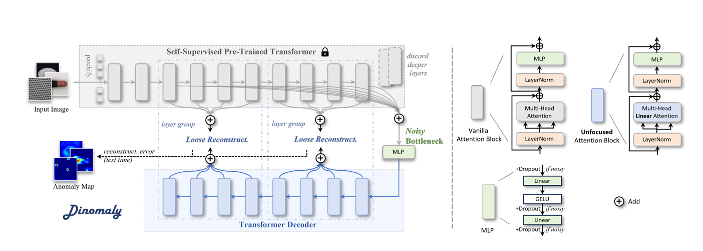

# Dinomaly: The Less Is More Philosophy in Multi-Class Unsupervised Anomaly Detection — 논문 조사 노트

PDF 파일 경로 : `method5_dinomaly/paper/CVPR25_Dinomaly_The_Less_Is_More_Philosophy_in_Multi_Class_Unsupervised_Anomaly_Detection.pdf`

---

## Paper Metadata

| Item | Content |
|---|---|
| Title | Dinomaly: The Less Is More Philosophy in Multi-Class Unsupervised Anomaly Detection |
| Authors | Jia Guo, Shuai Lu, Weihang Zhang, Fang Chen, Huiqi Li, Hongen Liao |
| Conference / Journal | CVPR |
| Year | 2025 |
| Paper link | https://arxiv.org/abs/2405.14325 |
| GitHub / Official code | https://github.com/guojiajeremy/dinomaly |
| Reason for investigation | 피드백에서 언급된 4개 방법(GLAD/SimpleNet/Reverse Distillation/Dinomaly) 중 하나. Foundation Transformer(DINOv2류) 기반 재구성 방식이라 diffusion 계열(DiAD/GLAD)과 메커니즘이 완전히 달라, H3/H4에 다른 각도의 증거를 줄 수 있을 것으로 기대. diffusion 없이 단일 forward pass로 재구성한다는 점에서 8GB GPU에서도 상대적으로 가벼울 것으로 예상되어 우선 조사 대상으로 선정.

---

## 1. 저자가 찾은 문제
MUAD는 여러 카테고리를 모델 하나로 동시에 학습할 수 있어 실용적이지만, 카테고리별로 모델을 따로 두는 방식보다 성능이 한참 떨어진다는 문제가 있다.
이 문제를 해결하기 위해 저자들은 복잡한 모듈을 더 얹는 대신 오히려 반대로 접근한다.
Attention과 MLP만으로 이루어진 순수 Transformer 구조(Dinomaly)에 네 가지 단순한 요소만 추가해 해결한다.

### 1-2 기존 연구의 한계
기존 이상탐지는 카테고리마다 모델을 하나씩 따로 학습하는 것이 일반적이지만 이 방식은 저장 공간이 많이 필요하고, 카테고리 수가 많아지면 비현실적이다. 그래서 최근엔 모델 하나로 모든 카테고리를 같이 학습하는 MUAD가 주목받는데, 여기서 문제가 되는 것이 'identity mapping'이다.

여러 카테고리의 다양한 정상 패턴을 한꺼번에 학습하다 보니 모델이 지나치게 일반화돼서, 이상(불량) 이미지까지 원본 그대로 복원해버리는 문제이다.

- **multi-class 설정이 어려운 이유**: 저자들은 일반화 능력이 원래 신경망의 장점이지만, 이상탐지처럼 '본 적 없는 것을 구분해내야 하는' 과제에서는 오히려 방해가 된다는 'over-generalization' 문제로 재정의한다.

### 1-3 관련 연구
- **Multi-Class UAD**: UniAD가 이 설정을 처음 제안했다. 이후 HVQ-Trans, LafitE, DiAD, OmniAL, ReContrast, , MambaAD 등이 이어졌다.
- **Foundation Transformers**: ViT 기반 자기지도 사전학습 모델(MoCov3, DINO, MAE, BEiT, iBOT, DINOv2 등)이 범용 feature를 제공한다는 최근 흐름을 이상탐지에 가져와, 어떤 사전학습 방식이 이상탐지에 유리한지 체계적으로 분석한 것이 이 논문의 새로운 지점이다.

### 1-4 DiAD/GLAD와 무엇이 다른가
diffusion 기반 재구성(DiAD/GLAD)과 달리, frozen foundation Transformer의 feature 위에서 단일 forward pass로 재구성한다는 것이 핵심 차이다. DiAD/GLAD는 반복적인 denoising 과정을 거치지만, Dinomaly는 encoder-bottleneck-decoder 한 번의 통과로 복원이 끝난다 — 학습·추론 비용 축에서 크게 갈린다.

## 2. 용어 (이 논문에서 쓰는 그대로)
- **identity mapping**: 모델이 입력을 그대로 출력으로 베껴버리는 현상. 정상만 학습했는데 이상 이미지까지 그대로 복원해버려 이상탐지가 실패하는 원인이 된다.
- **anomaly map**: 입력과 복원 결과의 차이(복원 오차)를 픽셀 단위로 계산한 지도. 값이 클수록 그 위치가 이상일 가능성이 높다는 뜻으로 쓰인다.

## 3. 방법 — 단계별로, 예시와 함께
### 3-1. 전체 구조 (Dinomaly Framework)

encoder-bottleneck-decoder 3단 구조로 이뤄진다.
encoder는 사전학습된 ViT(기본값: DINOv2-Register로 사전학습한 ViT-Base/14)를 그대로 freeze해서 쓰고, 12개 층 중 중간 8개 층의 feature를 뽑는다.
bottleneck은 그냥 MLP(feed-forward network) 하나다.
decoder는 8층 Transformer로, encoder가 뽑은 feature를 다시 복원하도록 코사인 유사도를 최대화하는 방식으로 학습한다. 테스트 시에는 정상 영역은 잘 복원되지만 이상 영역은 복원에 실패한다는 전제로, 복원 오차 자체가 anomaly map이 된다.

### 3-2. Foundation Transformer
- encoder로 DINOv2-Register 사전학습 ViT-Base/14 사용(대규모 데이터셋 자기지도학습 기반 범용 시각 표현 모델).
- 기존 이상탐지 연구는 "모델이 클수록 오히려 성능이 떨어진다"고 봤지만, Dinomaly에서는 **scaling law가 성립**한다(ViT-Small < Base < Large 순으로 성능 향상).
- ImageNet linear-probing 정확도(백본을 얼리고 선형 분류기만 붙여 재는 표현력 지표)가 높을수록 이상탐지 성능도 높다는 상관관계 확인 → 더 좋은 사전학습 모델이 나오면 Dinomaly도 자동으로 좋아질 여지.

### 3-3. Noisy Bottleneck
기존 연구들은 identity mapping을 막으려고 정교하게 설계한 pseudo anomaly(가짜 이상)를 입력 이미지나 encoder feature에 주입했다.
Dinomaly는 그 대신 MLP bottleneck에 원래 있는 **Dropout을 켠다.**
Dropout은 원래 과적합 방지용으로 쓰이지만, 여기서는 '일부 feature를 무작위로 지워서 정상 표현을 인위적으로 훼손하는 pseudo feature anomaly' 역할을 한다고 재해석한다.
denoising autoencoder에서 노이즈를 넣는 것과 같은 원리로, 이 장치 하나만으로도 별도 모듈 없이 decoder가 입력이 이상이든 아니든 정상 feature를 복원하려고 시도하게 만들어 identity mapping을 완화한다.

### 3-4. Unfocused Linear Attention
- Softmax Attention(`Softmax(QKᵀ)V`)은 쿼리와 관련된 위치에 좁게 집중하는데, 이게 자기 자신 위치에 집중하면 입력을 그대로 다음 층에 복사하는 Identity Mapping이 된다.
- Linear Attention(`φ(Q)(φ(Kᵀ)V)`, 원래는 계산량을 $O(N^2d)$→$O(Nd^2)$로 줄이려는 경량화 버전)은 Softmax가 없어 특정 위치에 집중을 못 하고 attention이 이미지 전체에 퍼진다 — 원래 이건 "집중 못 하는" 단점으로 여겨졌다.
- Dinomaly는 attention이 전체로 퍼지면 decoder가 한 위치의 정보만 그대로 베껴서 넘기기 어려워져(멀리 있는 정보까지 강제로 섞이니까) Identity Mapping이 줄어든다. 계산량 감소는 덤.

### 3-5. Loose Reconstruction
- 기존 방법은 encoder와 decoder의 층을 하나하나 정확히 맞춰서 복원시켰는데, 이렇게 너무 정확히 따라 하게 하면 decoder가 불량까지 그대로 베껴버린다(Identity Mapping).
- **Loose Constraint(제약)**: 층별로 딱 맞추는 대신, 여러 층을 얕은 층·깊은 층 2개 그룹으로만 크게 묶어서 복원 — 덜 정확하게 맞춰도 되니 decoder가 불량까지 억지로 베끼려는 압박이 줄어든다.
- **Loose Loss(hard-mining global cosine loss)**: 학습 중 이미 잘 복원된 포인트의 gradient를 1/10으로 shrink. 이미 잘되고 있는 포인트에 계속 집중하지 않고 어려운 포인트에 집중해, decoder가 정상 패턴을 너무 완벽하게 외우지 않도록 방지.
  - Dinomaly 적용: 이 손실 함수는 원래 ReContrast[14]에서 가져온 것을 그대로 사용. Loose Constraint로 묶은 2개 그룹(저수준/고수준)의 feature map에 대해 각각 계산하며, 배치(batch) 안에서 cosine distance가 작은 하위 k% 포인트만 gradient를 0.1배로 줄이고 나머지는 그대로 학습. k는 학습 초반 1,000 iteration 동안 0%에서 90%까지 선형으로 늘어난 뒤(warm-up) 그대로 유지된다. 최종 loss는 두 그룹 loss의 평균.

## 4. 실험 결과

### MUAD SOTA 비교 (Table 1)

| 데이터셋 | Dinomaly (Image AUROC) | 이전 MUAD SOTA | 향상폭 |
|---|---|---|---|
| MVTec-AD | 99.6% | 98.6%(MambaAD) | +1.0%p |
| VisA | 98.7% | 95.5%(ReContrast) | +3.2%p |
| Real-IAD | 89.3% | 86.4%(ReContrast) | +2.9%p |

- pixel-level도 같은 경향(MVTec 기준 98.4/69.3/69.2/94.8, 기존 대비 +0.7~1.7%p). image-level은 "거의 포화(saturated)"됐다고 표현할 정도.
- 학습 스케줄을 4~5배 늘린 Dinomaly†(20,000/20,000/100,000 iter)는 소폭만 더 오름(MVTec image-level 99.7) — iteration을 늘리는 것 자체는 이미 한계에 가까움을 시사.

### Class-separated SOTA와 비교 (Table 2)
- 카테고리별 모델을 따로 둔 방식이 원래 유리해야 하는데, Dinomaly는 multi-class(모델 하나)로 학습했음에도 class-separated 전용 모델(RD4AD, PatchCore, SimpleNet)보다 오히려 높은 성능(MVTec I-AUROC 99.6 vs PatchCore 99.1). "구조적으로 불리한 설정에서 유리한 설정의 SOTA를 이긴다"는 게 이 논문의 핵심 주장.

### Ablation (Table 3, MVTec-AD)

| NB | LA | LC | LL | Image AUROC |
|---|---|---|---|---|
| | | | | 98.41 |
| ✓ | | | | 99.06 |
| ✓ | ✓ | | | 99.27 |
| ✓ | ✓ | ✓ | | 99.52 |
| ✓ | ✓ | ✓ | ✓ | 99.60 |

- Noisy Bottleneck(NB)의 기여가 가장 크고 나머지가 그 위에 쌓이는 구조. 중요한 점: LA·LC는 **NB가 있어야** 효과가 크다 — NB 없이 LC(제약 완화)만 쓰면 "복원이 너무 쉬워져서" 오히려 성능이 떨어짐(3-5의 caveat). 네 요소가 서로 맞물려 작동한다는 뜻.

### 스케일링 & 사전학습 백본
- ViT-Small(37.4M) 99.26% → ViT-Base(148.0M) 99.60% → ViT-Large(275.3M) 99.77% — 모델이 클수록 일관되게 향상(기존 연구의 "스케일링 법칙 안 통함" 관찰과 반대).
- Table A1(부록): MAE만 눈에 띄게 나쁘고(96.27) 나머지 백본(DeiT/BEiTv2/D-iGPT/MOCOv3/DINO/iBOT/DINOv2/DINOv2-R)은 대부분 98% 이상 — 백본 선택에 강건함.

## 5. 결론 
Dinomaly는 Foundation Transformer, Noisy Bottleneck, Linear Attention, Loose Reconstruction 네 요소만으로 multi-class 이상탐지의 고질적 성능 저하(Identity Mapping)를 해결한 minimalist 프레임워크다. 특별한 모듈 없이도 기존 multi-class 방법은 물론 class-separated 방법까지 능가한다는 것을 MVTec-AD/VisA/Real-IAD 전반에서 보였다.

## 6. 내 연구와의 연결

- **계열이 같은가/다른가**: 큰 계열은 DiAD/GLAD와 같은 재구성 기반(reconstruction-based) — 입력과 복원 결과의 차이를 anomaly score로 쓴다는 원리는 동일하다. 다만 구체적 메커니즘은 완전히 다르다 — DiAD/GLAD는 diffusion으로 이미지를 반복적으로 복원하지만, Dinomaly는 frozen ViT feature를 decoder 한 번의 forward pass로만 복원한다.
- **접근이 다른가**: diffusion 기반 반복 denoising이 없는 단일 forward pass 재구성이라, 학습/추론 비용이 DiAD/GLAD와 크게 다르다(실측 iter당 약 0.6초 vs GLAD 약 47~70초/step).
- **우리 피드백/가설과의 연결**: 실제로 batch_size=4로 돌려본 결과, grid I-AUROC 0.9975로 PatchCore(0.977)를 앞서 H3를 지지하는 데이터 포인트가 됐고, transistor P-AUROC는 0.9238로 PatchCore(0.929)에 근접했지만 아직 못 넘어서 H4는 미결정으로 남음(`method5_dinomaly/source/eval_results_batch4_iter10000.csv`).
- **참고할 점 / 주의할 점**: 원 논문은 batch=16, RTX3090(24GB) 기준으로 설계돼 있어, 우리 8GB GPU에서는 시간 소요가 꽤 될것으로 예상됨.

